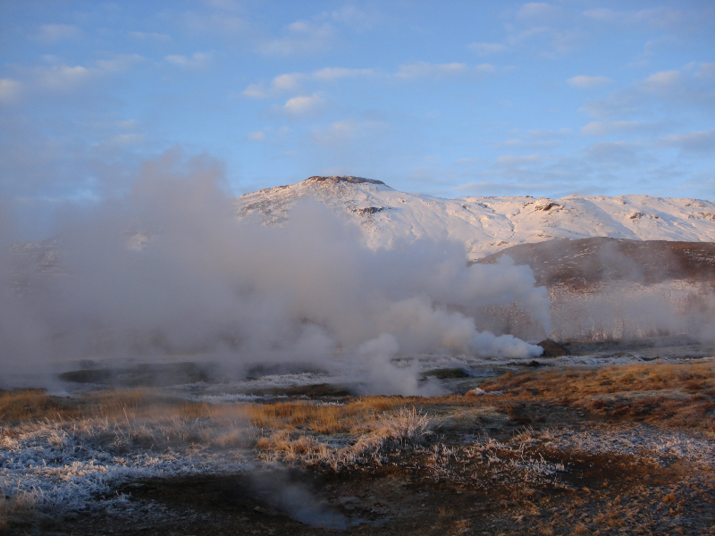

# Fluids in the crust

This repository contains lecture slides and Jupyter notebooks for a MSc. course named "Fluids in the crust" that was taught at the University of Göttingen from 2014 to 2020.

Feel free to contact me for questions at elco.luijendijk at posteo.net
 
Elco Luijendijk, january 2021

## Summary

* Learn about crustal fluid flow, geothermal processes and the role of fluids in geological processes
* Explore a diverse range of fluid flow systems, from large-scale meteoric groundwater flow to localized and deep fluid flow in faults
* Construct simple models of fluid and heat flow in the crust using Excel and Python and compare with datasets of temperature, pressure and/or fluid chemistry.

*Crustal fluids coming to the surface at a geyser field in iceland*

## Course contents

* The course contains a series of 14 lectures that introduce the theory of groundwater flow, heat flow, solute transport and deformation in the crust and that discuss crustal fluid flow systems in a range of geological settings. The slides are located [here](lectures) and you can find an overview here: [lectures/readme.md](lectures/readme.md)
* In addition, the course contains a set of exercises that let you build simple numerical models of crustal fluid and heat flow in excel and in [Python](https://www.python.org/) using [Jupyter notebooks](https://jupyter.org/). Follow this link to go to the exercises: [exercises/readme.md](exercises/readme.md)

## Rationale and aims

This course was designed to provide you with broad knowledge on the role of fluids in geological processes, which is relevant to many parts of the geosciences. This course was designed to also teach core scientific concepts such as how to critically evaluate model studies and compare models and geoscience datasets. In addition, this course provides key background information and skills for future research or industry work on topics such as geothermal energy, oil & gas exploration and radioactive waste storage. And finally, the course was also designed to make you familiar with the scripting language Python. Scripting languages like [Python](https://www.python.org/) or Matlab have emerged as key tools in research or industry work.
  

## Learning outcomes

After completing this course you will:

1. Have learned what factors control fluid flow in the crust and how fluid flow systems evolve over geological timescales
2. Have learned how fluid flow affects geological processes, such as heat flow and deformation. 
3. Have the ability to construct simple models of fluid and heat flow in Excel and Python
4. Be able to use hydrogeological data to evaluate numerical models of fluid and heat flow
5. Have learned to critically evaluate scientific literature and model studies of fluid and heat flow

## Citation

## License

 This work is licensed under a <a rel="license" href="http://creativecommons.org/licenses/by/4.0/">Creative Commons Attribution 4.0 International License</a>.

 